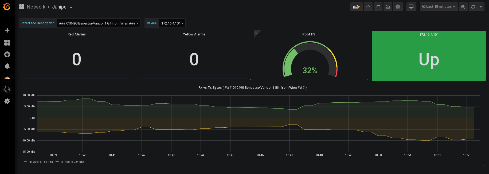
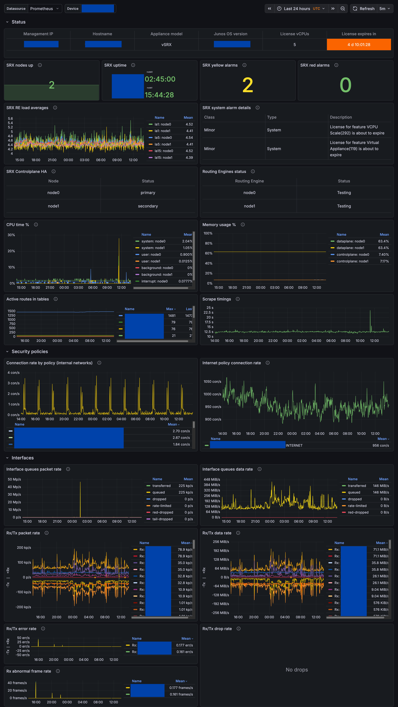

# junos_exporter Grafana dashboard examples

This directory contains some example dashboard implementations that can be used for inspiration/discovery of the available metrics.

## Classic dashboard

Example dashboard that has some basic variables to choose your device(s)/interface(s).
Required features: `default set`.

## SRX dashboard

Example dashboard designed specifically for SRX appliances.
Required features: `default set` + `bgp`, `cluster`, `license`, `security_policies`, `system`.

